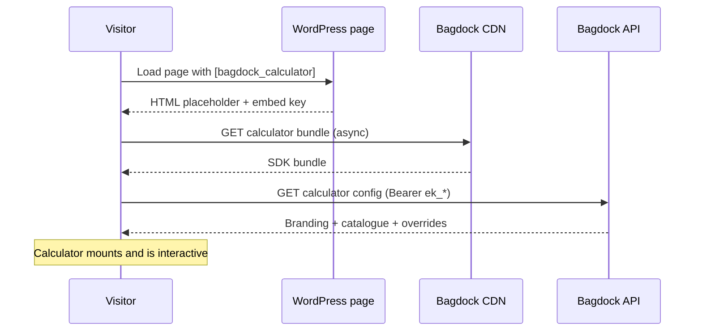

```
  ----++                                ----++                    ---+++     
  ---+++                                ---++                     ---++      
 ----+---     -----     ---------  --------++ ------     -----   ----++----- 
 ---------+ --------++----------++--------+++--------+ --------++---++---++++
 ---+++---++ ++++---++---+++---++---+++---++---+++---++---++---++------++++  
----++ ---++--------++---++----++---+++---++---++ ---+---++     -------++    
----+----+---+++---++---++----++---++----++---++---+++--++ --------+---++   
---------++--------+++--------+++--------++ -------+++ -------++---++----++  
 +++++++++   +++++++++- +++---++   ++++++++    ++++++    ++++++  ++++  ++++  
                     --------+++                                             
                       +++++++                                               
```

# Bagdock Calculator for WordPress

The official WordPress plugin for the Bagdock storage size calculator. Drop a real-time, region-aware size recommender into any page, post, sidebar, or footer — with a shortcode, a Gutenberg block, an Elementor widget, and a Classic editor button.

[](https://wordpress.org/plugins/bagdock-calculator/)
[](https://github.com/bagdock/bagdock-calculator-wp/releases)
[](LICENSE)

## Install

From the WordPress admin:

1. Go to **Plugins → Add New** and search for "Bagdock Calculator".
2. Click **Install Now**, then **Activate**.

Or from the command line:

```bash
wp plugin install bagdock-calculator --activate
```

Or download the latest `bagdock-calculator.zip` from [Releases](https://github.com/bagdock/bagdock-calculator-wp/releases) and upload via **Plugins → Add New → Upload Plugin**.

## How it works

Your WordPress site renders a lightweight placeholder. The Bagdock calculator SDK loads from the Bagdock CDN, hydrates the placeholder, and fetches your operator configuration from the Bagdock API. No build step, no npm, no server resources.



## Key types

Bagdock uses a Stripe-style three-tier key model. The plugin accepts **embed keys** only — the `calculator:read` scope is enough to render the widget safely from a public WordPress site.

| Prefix | Name | Use case | Scopes |
|--------|------|----------|--------|
| `ek_*` | Embed Key | Client-side widgets, iframes, WordPress | Origin-locked, read-only |
| `rk_*` | Restricted Key | Server-side integrations, catalogue edits | Granular scopes, no origin lock |

All keys support `live` and `test` environments:

```
ek_live_abc123…   // Production embed key
ek_test_abc123…   // Sandbox embed key
```

Create one from your [Bagdock](https://bagdock.com) operator account.

---

## Use cases

### 1. Drop it on the homepage (simplest)

After activating the plugin, add your embed key in **Settings → Bagdock Calculator**, then place this anywhere:

```
[bagdock_calculator]
```

That's it. The SDK inherits your operator branding and presets.

### 2. Scope to a single facility

For sites that sell a single location — or for per-facility landing pages — the calculator can honour that facility's custom rooms, items, pricing, and overrides:

```
[bagdock_calculator facility_id="fac_01HW…"]
```

Omit `facility_id` to fall back to operator-wide defaults. Facility scoping layers on top of the operator config, so edits you make in the operator dashboard still reach every placement.

### 3. Override presets per page

```
[bagdock_calculator preset="vehicle" button_label="Find my vehicle storage size"]
[bagdock_calculator preset="wine"    button_label="Find my wine storage"]
[bagdock_calculator preset="business" mode="inline"]
```

### 4. Wire the Apply event into your analytics

The SDK dispatches `CustomEvent`s on the container (bubbling to `window`):

```js
window.addEventListener('bagdock:calculator:apply', (e) => {
  gtag('event', 'calculator_apply', {
    size_bucket: e.detail.bucket,
    total_sqft: e.detail.totalSqft,
  });
});
```

Events fired:

| Event | Detail |
|---|---|
| `bagdock:calculator:open` | — |
| `bagdock:calculator:close` | — |
| `bagdock:calculator:apply` | `{ bucket, closestUnit, totalSqft }` |

---

## Integration surfaces

### Shortcode

```
[bagdock_calculator
    facility_id="fac_01HW…"
    preset="home-goods"
    region="uk_ie"
    storefront_url="https://example.com/book"
    button_label="Find my unit size"
    mode="button"]
```

| Attribute | Default | Description |
|---|---|---|
| `embed_key` | plugin setting | Override the embed key for this placement only. Rare. |
| `facility_id` | plugin setting | Scope to a single facility's catalogue and overrides. |
| `preset` | `home-goods` | One of `home-goods`, `vehicle`, `business`, `wine`. |
| `region` | auto-detect | `uk_ie`, `eu`, or `usa`. Controls the sizing ceiling. |
| `storefront_url` | plugin setting | Where visitors land after pressing **Apply**. |
| `button_label` | "Size calculator" | Trigger button copy (button mode only). |
| `mode` | `button` | `button` opens a modal; `inline` renders the calculator in place. |
| `class` | — | Extra CSS class for the wrapping `<div>`. |

### Gutenberg block

Search for **Bagdock Calculator** in the block inserter. Rendered server-side, so edits to the plugin propagate to existing posts without re-saving.

### Elementor widget

Drag **Bagdock Calculator** (general category) into any section. The left-hand panel mirrors every shortcode attribute.

### Classic editor button

A **Bagdock Calculator** button in the TinyMCE toolbar opens a small prompt (facility, preset, button label) and inserts a pre-filled shortcode at the caret.

---

## Filters

| Filter | Default | Purpose |
|---|---|---|
| `bagdock_calculator_always_enqueue` | `true` | Return `false` to skip the sitewide `wp_enqueue_scripts` hook and enqueue only when the shortcode/block actually renders. Useful on sites where the calculator appears on a single landing page. |

## Requirements

- WordPress 6.0 or newer
- PHP 7.4 or newer
- A Bagdock operator account with an embed key (`calculator:read` scope)

---

## Development

```bash
git clone https://github.com/bagdock/bagdock-calculator-wp
cd bagdock-calculator-wp
composer install
composer run lint
```

Optional — spin up a throwaway WordPress instance with the plugin mounted:

```bash
npx @wordpress/env start
```

## Release

Tagged releases (`v0.x.y`) trigger the `.github/workflows/release.yml` workflow, which:

1. Builds a plugin zip suitable for WordPress.org SVN submission.
2. Attaches the zip to the GitHub release.
3. Deploys to the WordPress.org plugin directory (once `WPORG_ENABLED` is set to `true` and `WPORG_SVN_USERNAME` / `WPORG_SVN_PASSWORD` secrets are configured).

See [CHANGELOG.md](./CHANGELOG.md) for the full release history.

## License

GPL-2.0-or-later. See [LICENSE](./LICENSE).

## Related packages

| Package | Registry | Description |
|---|---|---|
| [`@bagdock/calculator`](https://www.npmjs.com/package/@bagdock/calculator) | npm | React component and `<script>`-tag loader this plugin wraps |
| [`@bagdock/sdk`](https://www.npmjs.com/package/@bagdock/sdk) | npm | TypeScript API client for the Bagdock platform |
| [`@bagdock/hive`](https://www.npmjs.com/package/@bagdock/hive) | npm | AI-powered storage assistant |
| [`@bagdock/loyalty`](https://www.npmjs.com/package/@bagdock/loyalty) | npm | Referrals, rewards, and points |

## Links

- [Bagdock](https://bagdock.com)
- [`@bagdock/calculator` on npm](https://www.npmjs.com/package/@bagdock/calculator)
